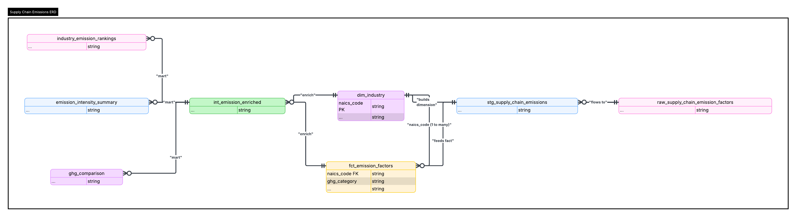

# 🌱 Supply Chain Emissions Analytics (dbt + Databricks)

## 📌 Overview

This project is an end-to-end **Analytics Engineering (ELT) pipeline** that transforms raw NAICS-based greenhouse gas (GHG) emission factor data into analytics-ready datasets using **dbt** and **Databricks (Unity Catalog)**.

The pipeline models supply chain emissions data into a **star schema** and produces business-ready marts for reporting and analysis.

---

## 🧠 Business Problem

Organizations often lack visibility into the carbon impact of their supply chain spending.

This project helps answer:

* Which industries have the highest emissions per dollar spent?
* How do margins affect total emissions?
* How can emissions data be modeled for scalable analytics?

---

## 🏗️ Architecture

```text
CSV (Unity Catalog Volume)
        ↓
Raw Table (Databricks)
        ↓
dbt Staging Layer
        ↓
Dimensional Model (Fact + Dimension)
        ↓
Intermediate Business Logic Layer
        ↓
Analytics Marts (BI-ready)
        ↓
Power BI Dashboard (optional)
```

---

## 🔄 Data Flow

```text
raw_supply_chain_emission_factors
        ↓
stg_supply_chain_emissions
        ↓
dim_industry        fct_emission_factors
        ↓              ↓
        └── int_emission_enriched
                     ↓
   industry_emission_rankings
   emission_intensity_summary
   ghg_comparison
```

---

## 🧱 Tech Stack

* **Databricks** (Serverless SQL Warehouse)
* **Unity Catalog Volumes** (data storage)
* **dbt (dbt-databricks)** (transformations)
* **Delta Lake** (storage format)
* **SQL** (modeling)
* **Power BI** (optional visualization)

---

## 🧩 Data Model

### 🔹 Source

* `raw_supply_chain_emission_factors`

### 🔹 Staging

* `stg_supply_chain_emissions`

### 🔹 Core (Star Schema)

* `dim_industry`
* `fct_emission_factors`

### 🔹 Intermediate

* `int_emission_enriched`

### 🔹 Marts

* `industry_emission_rankings`
* `emission_intensity_summary`
* `ghg_comparison`

---

## ⭐ Key Features

* Built a **modern ELT pipeline** using Databricks + dbt
* Designed a **star schema (fact + dimension tables)**
* Implemented **dbt testing and documentation**
* Created reusable **intermediate transformation layer**
* Developed **business-ready marts** for analytics
* Used **Unity Catalog volumes** for governed data ingestion

---

## 📊 Example Insights

* Identify high carbon-intensity industries
* Compare emissions with vs without margins
* Segment industries into High / Medium / Low emission categories
* Analyze emissions across greenhouse gas types

---

## 🧪 dbt Commands

```bash
dbt run
dbt test
dbt docs generate
dbt docs serve
```

---

## 📌 Sample Queries

### Top industries by emissions

```sql
select *
from industry_emission_rankings
order by avg_emission_factor_with_margins desc
limit 10;
```

### Emission intensity breakdown

```sql
select *
from emission_intensity_summary;
```

---

## 🧩 Entity Relationship Diagram (ERD)

### 📌 Overview

The model follows a **layered analytics engineering design**, with a core **star schema** supported by staging, intermediate, and mart layers.

---

### ⭐ Core Model

#### Dimension: `dim_industry`

* **Primary Key:** `naics_code`
* One row per industry

#### Fact: `fct_emission_factors`

* **Foreign Key:** `naics_code`
* **Grain:** 1 row per (`naics_code`, `ghg_category`)
* Stores emissions metrics

---

### 🔗 Relationships

* `dim_industry (1) → (many) fct_emission_factors`
* `stg_supply_chain_emissions → dim_industry`
* `stg_supply_chain_emissions → fct_emission_factors`
* `dim + fact → int_emission_enriched`
* `int_emission_enriched → marts`

---

### 📊 Intermediate Layer

#### `int_emission_enriched`

Adds:

* `margin_impact`
* `emission_intensity_band` (High / Medium / Low)

---

### 📊 Analytics Marts

* **industry_emission_rankings** → industry-level ranking
* **emission_intensity_summary** → category distribution
* **ghg_comparison** → cross-GHG analysis

---

### 📷 ER Diagram



---

## 📷 Screenshots (Recommended)

* dbt lineage graph
* Databricks tables
* ER diagram (Lucidchart)
* Power BI dashboard (optional)

---

## 🚀 Future Improvements

* Integrate external APIs (energy pricing, carbon data)
* Add time-series simulation for emissions trends
* Implement CI/CD for dbt (GitHub Actions)
* Build real-time ingestion pipeline

---

## 👤 Author

**Matthew Scott**
Aspiring Analytics Engineer / Data Engineer
Amazon Learning Ambassador & Problem Solver

---

## 💼 Resume Highlight

> Built a dbt-powered supply chain emissions analytics pipeline using Databricks and Unity Catalog, transforming raw NAICS-based carbon data into dimensional models and business-ready marts for emissions analysis and reporting.
